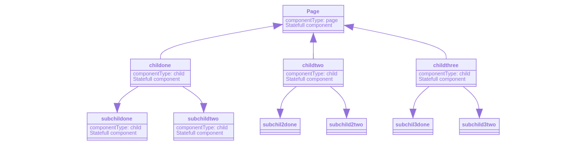

## Liven js
A scalable Frontend Javascript framework for high performance and flexibility for building solid Single Page Apps

### Use Cases
1. You can use this framework to build small single page apps
2. You can use this framework to build scalable and large single page apps
3- less dependencies more productivity
5- kick starting app

### Features
1. Component based
2. zero time to start your development process
3. Scalable Framework which allows you to build any type of single page apps
4. Uses Javascript Es6 code syntax and class concept
   Uses Javascript Proxy for real time dom updates
5. Solid Routing System
6. Dom Updating without emitting any functions to change the DOM
7. Isolated components and Data Model for every component
8. Writing isolated HTML component and JS component or writing them together in the same file
9. Shadow DOM based

**content**
  - [Installing](#installing)
  - [Setup]($setup)
  - [Getting Started](#getting-started)
  - [Liven Set Configuration](#liven-set-configuration)
  - [Component](#component)
    - [Extend Component](#extend-component)
    - [Component HTML](#component-html)
    - [Instantiate Component](#instantiate-component)
    - [Component Props](#component-props)
    - [Component Data](#component-data)
    - [Initialize Component](#initialize-component)
    - [Component Life cycle And Hooks](#component-life-cycle-and-hooks)
    - [Component auto runs](#component-auto-runs)
    - [Component While Loading](#component-while-loading)
    - [Component Elements Refs](#component-elements-refs)
    - [Component Access On Html](#component-access-on-html)
    - [Component Dom Events](#component-dom-events)
        - [Inline DOM Events](#inline-dom-events)
        - [Component Methods](#component-methods)
    - [Component Data Binding](#component-data-binding)
    - [Data Changing](#data-changing)
    - [Loop In Data](#loop-in-data)
    - [Component Event Emitter](#component-event-emitter)
    - [Child Components](#child-components)
    - [Looped Components](#looped-components)
    - [Page Component](#page-component)
    - [Liven Hide Pages](#liven-hide-pages)
    - [Conditional Rendering](#conditional-rendering)
    - [Component Partials](#component-partials)
 - [Router](#router)
    - [ Liven Route Types](#liven-route-types)
        - [Get Routes](#get-routes)
        - [Post Routes](#post-routes)
        - [Put Routes](#put-routes)
        - [Patch Routes](#patch-routes)
        - [Delete Routes](#delete-routes)
    - [Route Handler](#route-handler)
    - [Global MiddleWares](#global-middlewares)
    - [Route MiddleWares](#route-middleWares)
    - [Router URL define params](#router-url-define-params)
    - [Navigation](#navigation)
    - [Error Page](#error-page)
    - [Router add route](#router-add-route)
    - [Use Router class inside another router class](#use-router-class-inside-another-router-class)
    - [Submitting Forms](#submitting-forms)
    - [Router Hooks And Methods](#router-hooks-and-methods)
        - [Initialize Router](#initialize-router)
        - [Use MiddleWare](#use-middleware)
        - [Router listen when route happen](#router-listen-when-route-happen)
    - [Response Object](#response-object)
        - [Response.end method](#responseend-method)
        - [Response.write method](#responsewrite-method)
        - [Response.render method](#responserender-method)
        - [Response.status method](#responsestatus-method)
        - [Response.redirect method](#responseredirect-method)
    - [Swag Helpers](#swag-helpers)
## Getting Started
#### Example
```javascript
import {Liven, Component} from "liven"

class HomeComponent extends Component{

    constructor(props) {
        super(props);

        // define data
        
        this.$store.message = "hello";
        
        this.$store.frameWork = "liven"
        
        // init the component on instantiate
        this.init();
    }
    render() {
    
    return `<div class="component">
            <h1>{{message}} {{frameWork}}</h1>
        </div>`
    
    }
}
// instantiate the home component class
const home = new HomeComponent({

    // define the parent element

    parent: ".app",
    uniqueName: "homeComponent"
})
```

#### installing
```
npm install liven
```

#### install liven cli
Liven Js represents a cli package to use to instantiate new app, generate components, pages and routes
```
npm install -g liven-cli
```

This command will install liven cli globally on your machine, once this is done you are now able to instantiate new liven application, to do that you can read the documentation of the package from here
[live-cli](https://www.npmjs.com/package/liven-cli)

## Create html file called ``index.html``

```html

<!DOCTYPE html>
<html lang="en">
<head>
    <meta charset="UTF-8">
    <meta name="viewport" content="width=device-width, initial-scale=1.0">
    <meta http-equiv="X-UA-Compatible" content="ie=edge">
    <title>liven-demo</title>
    <link rel="stylesheet" href="/dist/css/app.css">
</head>
<body>
    <header></header>
    <div id="app"></div>
    <script src="/app.bundle.js"></script>
</body>
</html>
```

# Liven Set Configuration
Liven gives you a method to set your liven js app configuration

```javascript
Liven.setConfig({
    mode: "development" || "production",
    // global error page will be executed for all routes if there is no router error page
    errorPage(req, res) {

    }
    // define variables accessible from anywhere
    locals: {

    }
})
```
# Component
Liven js is build upon component concept, it divides the web page into components and every component can contain many and many small components inside it and every component is isolated with specific data model which is active along the time and reflects dom changes once you change the data of that component

Liven js uses Javascript Es6 classes to extend Liven js component class to your own custom components
Liven js uses native html elements without shadow root or web components to give you best performance and SEO optimization

**Example**
```javascript
import {Liven, Component} from "liven"

class HomeComponent extends Component{

    constructor(props) {
        super(props);

        // define data
        
        this.$store.message = "hello";
        
        this.$store.frameWork = "Livenjs"
        
        // init the component on instantiate
        this.init();
    }
    render() {
    
    return `<div class="component">
            <h1>{{message}} {{frameWork}}</h1>
        </div>`
    
    }
```

to create your first Livenjs Component you need to import Liven and Component classes from liven as the following:

```javascript
import {Liven, Component} from "liven"
```
## Extend Component
Now to write your own component you need to extend a class from Component class like the following

```javascript
class Header extends Component{
    // call constructor
    constructor(props) {
        super(props);
    }
}
```
### Component Html
Every component should have some props as setting object for this component and you should pass these props to the super class as the above example

Maybe you are asking now how will you write html content inside Js file !!!

You have two options to write component html content as the following

- write html elements as string inside render function in component class
- write html content in separated html file

```javascript
class Header extends Component{
    // call constructor
    constructor(props) {
        super(props);
    }
    // render method to render html content
    render() {
        return `
            <header>
                <nav>
                    <h1>Header Component</h1>
                </nav>
            </header>
        `
    }
}
```
### Write HTML component in separate file

create new html file in comoponent folder and import this file in js component as the following:
```javascript
import {Liven, Component} from "liven";
import html from "./Header.html";
class Header extends Component{
    // call constructor
    constructor(props) {
        super(props);
    }
    // render method to render html content
    render() {
        return html;
    }
}
```

Until now Livenjs component will not be working because you need two things:
1. create a parent element in html page to put this component inside it
2. instantiate this component and initialize it


## Instantiate Component
Now you need to instantiate ``Header`` component that you have created and initialize it
```javascript
const header = new Heder({
    parent: document.querySelector("header")
});
```
## Component Props
When you instantiate a new component there are some configuration and settings you can set to that component, some of these settings are mandatory and others are optional

#### component ``props`` object
|key |description |value |required |type |
|-|-|-|-|-|
|parent|the html parent that you want to assign this component to it|document.querySelector or string|true|dom element or string |
|uniqueName|a unique name or id you assign to this component |componentName|true|string |
|animate |animation you want to add to the component when it initialized |Object |false | Object|
|fadeIn |fadeIn animation you want to add to the component when it initialized |Object |false | Object|
|slideDown |slideDown animation you want to add to the component when it initialized |Object |false | Object|


## Component Data
Liven Js component has different ways to define data inside it, it's a javascript object which can contain all data you want to define also it can includes your methods!!

Liven Component class has a prepared object named `$store`, this object is designed specifically for data that are related to the view and rendering, because that, this object is based on javascript Proxy which is designed to be observed.

if you are coming from React vision so you may imagine that there is a function or method you have to call to change the some data in your model and see the reflect on the DOM, but in Liven you don't need anything like that, you just need to define your data inside `$store` object and the view will be changed automatically according to `$store` changes

### Defne data in `$store` object
```javascript
class App extends Component {
    constructor(props) {
        super(props);
        // this counter can be changed later
        this.$store.counter = 0;
    }
}
```
here inside the component class I defined a counter property inside `$store` observed object you can use this value inside your html content as the following:
```html
    <p>{{counter}}</p>
```
this value is always observed so once you change it from javascript, you will see an immediate reflect in DOM

**full Example**
`app.html`
```html
    <app>
        <div class="app-container">
            <!-- use counter property here -->
            <p>{{counter}}</p>
            <button elementName="counterButton">click to increase count</button>
        </div>
    </app>
```
`app.js`
```javascript

import { Liven, Component } from "liven";
import html from "./App.html";
// define wrapper component
class App extends Component {
    constructor(props) {
        super(props);
        this.$store.counter = 0;
    }
    // render method to render html
    render() {
        return html;
    }
    load() {}
    // methods
    methods() {
        return {
            counterButton: {
                click:() => {
                    this.$store.counter++;
                }
            }
        }
    }
}
// export App component
export default new App({ parent: "app", type: "child"});
```
### Observed Data Types

Liven Component can observe any data type you want and it also observe infinity nested data inside `$store` object, so it can contain the following data
- boolean
- strings
- numbers
- objects
- array of strings
- array of numbers
- array of objects


## initialize Component

```javascript
header.init();
```
This function makes initialization to the component, also you can make the component auto initialized when you instance a new component like the following
```javascript
class Header extends Component{
    // call constructor
    constructor(props) {
        super(props);
        // initialize the component
        this.init();
    }
    // render method to render html content
    render() {
        return `
            <header>
                <nav>
                    <h1>Header Component</h1>
                </nav>
            </header>
        `
    }
}
const header = new Heder({
    parent: document.querySelector(".header")
});
```

#### Component Life Cycle And Hooks
Liven Component passes with some cycles starts from init event and ends with out method
1. ``component.init() method``

THis method is mandatory to use to initialize the component like the example above

2. ``component.onInit()``

This method you use inside the component class to make some events or any logic you want to apply when the component is initialized

3. ``component.load()``

This method you use inside the component class to make some events or any logic you want to apply when the component is fully loaded

4. ``component.beforeOut()``

This method you use inside the component class to make some events or any logic you want to apply when the component is outing

4. ``component.beforeOut()``

This method you you can use to make the component is out which means removing the component from the dom, you can use this method from anywhere inside the application by calling the component inside the targeted file

**Example**

```javascript
class App extends Component{
    constructor(props) {
        super(props);
    }
    onInit() {
        alert();
    }
    load() {

    }
    beforeOut() {

    }
}
```

## Component Auto Runs
When it comes to working with data, maybe you ask yourself how would you get the data from AJAX requests and render this data into your component, and how this will work in async ?!

Liven Js offeres to you differen ways to get Ajax data rendered into your component

- calling Ajax while rendering the component
- calling Ajax before initializing the component
- calling Ajax after initializing and loading the component

The first options is considered as a challenge if it's not optimized or planed, but Liven is here to solve this problem

Liven Js offeres a way to define functions that will be run automatically while you initialize the component and you can define these functions as the following:

```javascript
class App extends Component{
    constructor(props) {
        super(props);
        // define array called auto runs
        this.autoRuns = [];
    }
}
```
As you can see we defined an array called `autoRuns` which is an array, this array accepts functions to be passed to it and these functions will be run automatically when the component is initialized

```javascript
class App extends Component{
    constructor(props) {
        super(props);
        // define array called auto runs
        this.autoRuns = [this.loadData];
    }
    loadData() {
        fetch("https://test/com/data").then((res) => res.json())
        .then(data => {
            this.$store.data = data;
        })
        .catch(err => {
            rconsole.log(err);
        })
    }
}
```
## Component While Loading

maybe you want to apply something on the component while loading it, for that there liven gives you a specific html element you can use to add loading effects

**Example**

```html
<component {{this.componentId}}="{{self.componentId}}">
    <div elementName="img-box-select" imageId="{{image._id}}" index="{{index}}" class="box img-box-select {{image.selected}}">
        <div while-loading="true" class="skeleton-loading"></div>
        <div class="has-text-white"><span class="has-text-white badge has-background-success">Image ID</span> <span spellcheck="true" class="has-background-white has-text-primary">{{image._id}}</span></div>
        <figure elementName="imagePreview" class="image image-box">
            
        </figure>
    </div>
</component>
```

any element you can specify `while-loading` attribute as true to the element and liven automatically will render this element while the component is loading and also will remove it once the component is fully loaded
**Note**
This way is good when you use async tasks or fetch data using AJAX

## Component Elements Refs

Liven Js gives you the ability to make reference for some elements of the component to use these elements easily outside or inside the components

To give reference for an element inside the component you can define an attribute named `elementName` this attribute defines custom name to this element to access on it easily

**Example**
```html
<component>
<button elementName="button"></button>
</component>
```

As you can see, we specified the button as button using `elementName` attribute. Now we can access on this element inside the component using the following syntax

```javascript
class App extends Component{
    constructor(props) {
        super(props);
    }
    load() {
        console.log(this.button); // button element
    }
}
```


**Note**
you can give multiple elements the same `elementName` value but when you access on it from the component it will be an array of elements

## Component Access On Html
Liven Component provides you a way to access on the component rendered html content in case you want to use the native javascript html query methods so you can access on it using the following syntax

```javascript
class App extends Component {
    constructor(props) {
        super(props);
    }
    load() {
        console.log(this.self) // output the whole rendered html component
    }
}
```

Also you can access on the component parent that the component is rendered inside by the following syntax
```javascript
console.log(this.parent) // outputs the parent
```


## Component Dom Events

Liven Js treats with Dom Events with two ways
- inline DOM events
- component methods

### Inline DOM Events
Liven js uses the native javascript dom events naming convention so you can write inline DOM events inside html like the following

```javascript
<div onclick="(e) => {
    console.log(this) // outputs the component class
}">
</div>
```

This way is preferred to many developers so you can use it with any dom event. Don't worry we use the native html5 DOM events naming to clear the confusion.

In this way maybe you want to refer the event to a function exist in the component controller so you can easily do the following
```html
<button onclick="this.clickHandler.bind(this)">
</button>
```

and inside the component class you can define a method as the following

```javascript
class App extends Component {
    constructor(props) {
        super(props);
    }
    load() {
    }
    clickHandler(e) {
        console.log("clicked")
    }
}
```

We added the method name in html content with bind to change the context of the function to into the component class, however you can access on the clicked element using `event.target` as you do in vanilla javascript.


### Component Methods

This is the second way which gives you the ability to add DOM events to your html component inside the component controller not inside html structure, which gives you more clean code

This can happen by one of the following ways
- giving the html element an `elementName` attribute value as we explained above
- giving an id to html element

once you do that, inside the component class you can define a method called `methods` which returns and object contains the refs with `elementName` or `id` and the dom events names
**Example**
```html
<button elementName="buttonElem">
click here
<button>
```

js file
```javascript
class App extends Component{
    constructor(props) {
        super(props);
    }
    methods() {
        return {
            buttonElem: {
                click: (event, element) => {
                    console.log("clicked")
                }
            }
        }
    }
}
```
As you can see Above, it's super easy to define your DOM events!
here also we use the native DOM Events naming so in the click listener is inside an object with the key of the element name and the value is an object contains all dom events you want to add to this element or group of elements with the same name

## Component Data Binding
Data binding is one of the most important things that matter developers when using a new framework or library, which making the interaction with the DOM more easier, cleaner and flexible.

Liven Js provides you an efficient and smart, flexible system which allows you render your data inside html elements easily.

Liven js is built on handlebars template engine to bind and render data inside html content, it implements handlebars inside it to make it easier on you to write your data inside html

As we explained above, there is a built-in object inside liven component called `$store` which contains all data that you want to render inside the view, and you can access on it's data easily as the following

`app.js` component
```javascript
import html from "./App.html";
class App extends Component{
    constructor(props) {
        super(props);
        this.$store.title = "Liven Js Demo App";
        this.$store.message = "liven js is awesome !!";
    }
    render() {
        return html;
    }
}
```

`app.html` component
```html
<component>
    <h1>{{title}}</h1>
    <p>{{message}}</p>
</component>
```

The output is:

# Liven Js Demo App
liven js is awesome !!

### Data Changing
You Can Change the data easily
as the following
```javascript
class App extends Component{
    constructor(props) {
        super(props);
        this.$store.title = "Liven Js Demo App";
        this.$store.message = "liven js is awesome !!";
        // change message after five seconds
        setTimeout(() => {
            this.$store.message = "message is changed automatically !!!"
        }, 5000)
    }
    render() {
        return html;
    }
}
```

this will make the message is changed after five seconds, you can make button to click on to change it or any idea you have.

## Loop In Data
Liven js supports loops in data binding to render lists, dynamic arrays and so on.

to make looping you have in the first define an array in your data model as the following

```javascript
constrcutor(props) {
    super(props)
    this.$store.frameworks = [{
            name: "Liven Js"
            rate: 5
        }, {
            name: "Angular"
            rate: 4
        }, {
            name: "React"
            rate: 4
        }
        {
            name: "Vue"
            rate: 4
        },
        {
            name: "Svelt"
            rate: 4
        }]
}
```
These data we want to render inside the component view so how we can get it work !?

it's so easy, what you need is creating the html file and put your structure inside it
```html
<component>
<ul>
</ul>
</component>
```

this `ul` element we will render frameworks data inside it, so Liven js considers this element as the parent of the loop, so to tell Liven that this is the parent of looped data that the looping will occurs in you have to add the following attribute:
`loop-name`
```html
<ul loop-name="frameworks">
</ul>
```
The value of this attribute should be the name of the array that you will loop in.
in our case the array is called `frameworks` so we have to specify the `loop-name` attribute with the same name of the array
```html
<ul loop-name="frameworks">
</ul>
```

After that, as handlebars does, you have to write the structure of handlebars that makes loop in arrays as the following:

```html
<ul loop-name="frameworks">
    {{#each frameworks as | framework index|}}
    <!-- here the html content that will be looped -->
    {{/each}}
</ul>
```

This above syntax is used for looping in handlebars.
firstly you specify the name of the array that you will loop in, then add `as |` then specify two keys you will use inside the loop

- the first key is the name of the single item inside the array which we named as `framework`
- the second key is the index number of the single item inside the array

Then you can now write `li` element as the following:

```html
<ul loop-name="frameworks">
    {{#each frameworks as | framework index|}}
        <li></li>
    {{/each}}
</ul>
```

This `li` element will be looped as the length of array is.

The element inside the loop should also has some attributes to be defined to tell liven that this item has X index, cuz liven uses these information to update the changes that happens in array items later and re render the changed item only automatically

the attributes should be specified are:

- `key-loop` which is the name of the rendered array and the current index of the item
- `key-index` which is the current index of the item
- `key-name` which is the name of the single item which we specified in `each` block

**Example**
```html
<ul loop-name="frameworks">
    {{#each frameworks as | framework index|}}
        <li key-loop="frameworks.{{index}}" key-name="framework" key-index="{{index}}"></li>
    {{/each}}
</ul>
```
as you can see that the `li` element has now three attributes

- `key-loop` which is the deep key inside the array so for example if the current item in the loop is the first item so the `key-loop` when be rendered will be `frameworks.0` and it will be increase for each index

- `key-name` then name of the single item that you specified in `as` in `each` block

- `key-index` which is the number of the current item in the array

**Full Example**
```html
<ul loop-name="frameworks">
    {{#each frameworks as | framework index|}}
        <li key-loop="frameworks.{{index}}" key-name="framework" key-index="{{index}">
            <p>{{framework.name}}</p>
            <span>{{framework.rate}}</span>
        </li>
    {{/each}}
</ul>
```

## Component Event Emitter

Each Liven Component includes a built in event emitter ecosystem that it can be used to trigger events and listen on events happens inside the component from inside it or from outside the component

### Access on Component event emitter
Event emitter is a property inside the component named `_events`
so you can access on it as the following:
```javascript
class App extends Component{
    constructor() {
        this._events.on("data", () => {})
    }
}
```

This is useful for you to add your event inside the component and listen on the component changes.
For example if you wan to notify the component that there is a new data, but you don't need to do that inside the component, you want to accomplish that from outside it so you can access on the event emitter from anywhere and trigger an event as the following

```javascript
class App extends Component{
    constructor() {
        this._events.on("data", (data) => console.log(data));
    }
}
let app = new App({
    parent: document.querySelector("#app"),
    uniqueName: "app",
    type: "child"
})
app._events.emit("data", {message: "data is emitted"})
```


### Child Components

Liven Component ecosystem is component based so it divides every part in the application to a component and every component can contain its child components even these nested components can contain also other childs!!

Here is a diagram explains how Components are working



There is two ways to include child components in Liven

- Inject child inside parent
- use child inside parent component

### Inject child inside parent

One of the main is injecting components inside other components while instantiating

Imagine that you have a component called header, this component includes the navbar and side menu as separate components so you have three components as the following:

```javascript
class Header extends Component{
    constructor(props) {
        super(props);
    }
}
class NavBar extends component{
    constructor(props) {
        super(props);
    }
}
class SideMenu extends component{
    constructor(props) {
        super(props);
    }
}
```

so now wee need to inject `navBar` and `SideNenu` components inside `Header` component so you can do something like this:
```javascript
// instantiate new nav bar
let navbar = new NavBar({parent: "#navbar", type: "child"})
// instantiate new side menu
let sideMenu = new sideMenu({parent: "#sideMenu", type: "child"})
let header = new Header({
    parent: "#header",
    // inject navbar and sidemenu components
    childComponents: [
        navBar,
        sideMenu
    ]
})
```

so to inject child components inside another component you can use property called `childComponents` when you instantiate new component

`childComponents` is an array of instantiated child components

**Note**
the child component to be injected and rendered inside another component you need to specify the type property of the child component when you instantiate it as the following:
```javascript
new NavBar({
    // specify the type
    type: "child"
})
```

### Specify the parent of child component

when you instantiate the child component, you can specify the parent of this component inside string, it can be one of the following:
- element name
- class name of the element
- id of the element
 so Liven will automatically search on the specified element and append this component to it

 **Example**
 ```javascript
 new NavBar({
    // specify the type
    type: "child",
    parent: "header"
})
 ```
so inside the paren component which you inject this child in, Liven will get the parent from this component and append this child to it

### use child inside parent component
There is another way to add child components inside another component without injecting these childs

this way is using instantiating new instance of the component inside the parent component itself as the following:

```javascript
class NavBar extends component{
    constructor(props) {
        super(props);
    }
}
class Header extends Component{
    constructor(props) {
        super(props);
        this.NavBar = new NavBar({
            // specify the parent
            parent: "#navbar"
        })
    }
}
```


now this child is instantiated inside the parent and became on of the parent component properties, you can then access on it from anywhere inside or outside the parent component
**Note**

the child is not rendered yet so you can render it once the component is loaded as the following:

```javascript
class NavBar extends component{
    constructor(props) {
        super(props);
    }
}
class Header extends Component{
    constructor(props) {
        super(props);
        this.NavBar = new NavBar({
            // specify the parent
            parent: "#navbar"
        })
    }
    // once the component is loaded
    load() {
        // initialize and draw the nav bar
        this.NavBar.init();
    }
}
```


## Looped components

Maybe you asked yourself how can I use child component inside dynamic loop
Liven provides you an elegant way to add child component inside the loop

### The Purpose of using child component inside the loop

Imagine that you have an array of users and you want to list these users, however you have some group of actions on the listed users like update, delete, activate or deactivate
Putting all these actions inside the parent component maybe will be a headache for you so the better way is creating two components, one is the parent component that has the array of users, and the other component is the user component itself, which will manage the state for each user inside the loop

**Javascript component**
```javascript
class UsersList extends Component{
    constructor(props) {
        super(props);
        this.$store.users = [
            {
                name: "tarek",
                age: 21,
                active: true,
            },
            {
                name: "john",
                age: 24,
                active: true,
            },
            {
                name: "ahmed",
                age: 25,
                active: true,
            },
            {
                name: "lina",
                age: 27,
                active: true,
            }
        ]
    }
}
```
Until now everything is similar to what you do in the normal loop
you will define inside your html code the loop as the following

**HTML Component**

```html
<div>
    <div loop-name="users">
        {{#each users as |user index|}}
            <div class="child"
            key-loop="users.{{index}}" key-name="user"
            key-index="{{index}}">
            </div>
        {{/each}}
    </div>
</div>
```

This is the default looping way that we do in liven

To make the looped item as a separate component you need to define some attributes inside the element which is exist inside the loop as the following:

**attributes to define for looped component**
|attr|value|description|
|-|-|-|
|type|component|specify this element as component to notify liven that this is a component|
|componentName|user|the name of the component to be rendered|


**Example**
```html
<div>
    <div loop-name="users">
        {{#each users as |user index|}}
            <div class="child"
            key-loop="users.{{index}}" key-name="user"
            key-index="{{index}}"
            type="component"
            componentName="user"
            >
            </div>
        {{/each}}
    </div>
</div>
```

so these two new attributes you have added notify Liven that there is a looped component should be used here

then inside the javascript component you need to pass a new property to the parent component called `loopedComponents` which is an array of the the components you want to use inside the loop, if you have different loops need different components so you can pass more than one component

**Example**

```javascript
// define use list component
class UsersList extends Component{
    constructor(props) {
        super(props);
        this.$store.users = [
            {
                name: "tarek",
                age: 21,
                active: true,
            },
            {
                name: "john",
                age: 24,
                active: true,
            },
            {
                name: "ahmed",
                age: 25,
                active: true,
            },
            {
                name: "lina",
                age: 27,
                active: true,
            }
        ]
    }
}
// define user component
class User extends Component{
    constructor(props) {
        super(props);
    }
}
// instantiate the component
const userList = new UserList({
    parent: "#user-list",
    loopedComponents: [
        // pass user component
        {
            name: "user", // should be the same name of componentName attribute that you defined in html
            Component: User
        }
    ]
})
```

as you can see, you can define an array called `loopedComponents` inside the parent component options and this property is an array you can pass in the components you need to use in the loop

loopedComponents is an array of object, each object should contain the following properties
|property|type|description|
|-|-|-|
|name|string|the name of the component that you have passed in componentName attribute in html|
|Component|Object|the component class you want to use inside the loop|

### Passing data to dynamic components inside loop

Sure when you use dynamic component inside a loop, you need to pass data from parent to this child
```html
<div>
    <div loop-name="users">
        {{#each users as |user index|}}
            <div class="child"
            key-loop="users.{{index}}" key-name="user"
            key-index="{{index}}"
            type="component"
            componentName="user"
            data-user="{{json user}}"
            >
            </div>
        {{/each}}
    </div>
</div>
```
As you can see, there is a new property is added called `data-user` contains the user data, so to pass data to dynamic component you can pass it using `data` attribute which can take an object or number or string
**Note**
to pass object you need to use `json` helper which converts the object to json to make it passed to another component through html
to access on the passed data from the child component you can access on it from props as the following:
```javascript
class User extends Component{
    constructor(props) {
        super(props);
        // output user data
        console.log(this.user);
    }
}
```
This outputs the user data which is passed from the parent component to the child
## Page Component
As we discussed before, Liven is component based, every part in the page is a component also the page itself could be a component

Imagine you want to build SPA contains different pages for example, user profile page, setting page, news feed page and friends page and each page contains group of components so how can this be achieved in Liven?

You can define the page as you define a regular component but instead of specify the type of this component as child, you can specify the type as page like the following:

```javascript
class Home extends Component{
    constructor(props) {
        super(props);
    }
}
const home = new Home({
    parent: "#app",
    type: "page"
})
```

now this is a page, you can now inject child components and do everything you can do with the regular component

**Note**
Pages are used in liven when you want to navigate from route to another route, so please tak a look at Router section to know how to navigate between pages in liven

## Liven Hide Pages
in Liven you can hide all the current pages and make all of them out with all the child components of each page, this can happen by calling the following built in function in Liven
```javascript
Liven.outComponents("page").then(() => {

}).catch(err => {

})
```

This method takes one paramter which is the type of components you want to hide, in this case it will be the page type to hide all pages

THis function returns a promise to do something after hiding these pages

## Conditional Rendering
Liven is based on handlebars so it uses the same code style to make conditions inside your THML Template however Liven gives you more flexibility to make fully Js logical conditions inside your HTML Template

**Example**

```html
<div>
<!-- make condition -->
{{#L-if 'rendered'}}
<h1>Component is rendered</h1>
{{/L-if}}
</div>
```

This is the condition syntax of html content in Liven component, but there are some additional things you need to know

to make condition statement in html template you need to put this condition inside a parent element and this element should contain specific attribute called `:key` which represents the key condition that will be used to track the changes in the data model

for example if you need to check if the component is loaded or not you may do something like this in your js component
```javascript
class App extends Component{
    constructor(props) {
        super(props);
        this.$store.rendered = false;
    }
    load() {
        // make the component is rendered
        this.$store.rendered = true;
    }
}
```

Inside your html to make condition based on this property you need to specify that this condition is based on or track this property so you can do something like the following:

```html
<div>
    <p :key="rendered">
    {{#L-if 'rendered == true'}}
        yes component is rendered
        {{else}}
        not rendred yet
    {{/L-if}}
</div>

```
Inside the `L-if` statement you can add any logical operations to be performed as you do in javascript code

## Component Partials
Liven js Component gives you the ability to distribute the component HTML code over different files, so it may help you to extend your code easy and make HTML part reusable can be used in different components as long as different places

### What is partials?
If you worked before with handlebars or any template engine, maybe you heard before about partials inside your template which is dividing the html code into parts and call these parts inside HTML Template, and this exactly what you can do if you want to inject some html content inside HTML Component

### Adding partial in Liven Component
to add partial in the component you need firstly to define this partial in JS
The partials can be defined inside the component as an array of objects
each object should have the following properties
|property|type|description|
|-|-|-|
|name|string|the partial name you want to inject inside html content this name will be used inside the HTML Component|
|body|HTML|this is the html content that will be injected inside the component|
**Example JS Component**
```javascript
class App extends Component{
    constructor(props) {
        super(props);
        // define partials
        this.partials = [{
            name: "modal-body",
            body: `
                <h1>I am partial!!</h1>
            `
        }];
    }
}
```
**Example HTML Component**
```html
<component>
<!-- inject partial -->
    {{> modal-body }}
</component>
```

# Router
Liven includes a built in Router class which is extendable to build routes to navigate inside your application
Liven Router is designed to be similar to nodejs backend routers, specially [grandjs framework](https://github.com/tareksalem/grandjs)

Router is built upon the following:

- Js Es6 OOP
- middleWares
- Route handlers

Liven represents a Router class which is can be used to extend and inherit routes from it, you can access on this router from liven as the following:

```javascript
// import needed parts from liven
import {Component, Liven, Router} from "liven";
```

You can extend this router class easily using ES6 inheritance
```javascript
class AdminRouter extends Router{
    constructor(options) {
        super(options)
    }
}
```

This class takes one argument which is an object called `options` should be passed to the super, this object contains the following properties you need to define when you instantiating this class

|property|type|description|
|-|-|-|
|base|string| the base url that this class will work on for example `/admin`|

## Liven Route Types
Liven Js Router can contain the following types of routes
- get routes (with method get)
- post routes (with method post)
- put routes (with method put)
- patch routes (with method patch)
- delete routes (with method delete)

## Get Routes
Inside the router class you can define get routes as the following:

```javascript
class AdminRouter extends Router{
    constructor(options) {
        super(options)
        this.getRouters = [];
    }
}
```
## Post Routes
Inside the router class you can define get routes as the following:

```javascript
class AdminRouter extends Router{
    constructor(options) {
        super(options)
        this.postRouters = [this.postRoute()];
    }
    postRoute() {
        return {
            url: "/",
            method: "POST",
            handler: (req, res) => {
                // output the submitted data
                console.log(req.data)
            }
        }
    }
}
```
## Patch Routes
Inside the router class you can define get routes as the following:

```javascript
class AdminRouter extends Router{
    constructor(options) {
        super(options)
        this.patchRouters = [patchRoute];
    }
    patchRoute() {
        return {
            url: "/",
            method: "PAPOSTTCH",
            handler: (req, res) => {
                // output the submitted data
                console.log(req.data)
            }
        }
    }
}
```
## Put Routes
Inside the router class you can define get routes as the following:

```javascript
class AdminRouter extends Router{
    constructor(options) {
        super(options)
        this.putRouters = [putRoute];
    }
    putRoute() {
        return {
            url: "/",
            method: "PUT",
            handler: (req, res) => {
                // output the submitted data
                console.log(req.data)
            }
        }
    }
}
```

## Delete Routes
Inside the router class you can define get routes as the following:

```javascript
class AdminRouter extends Router{
    constructor(options) {
        super(options)
        this.deleteRouters = [deleteRoute];
    }
    deleteRoute() {
        return {
            url: "/",
            method: "PUT",
            handler: (req, res) => {
                // output the submitted data
                console.log(req.data)
            }
        }
    }
}
```
now to add new route you can create new method, this method should return an object contains the following properties
|prperty|type|description|
|-|-|-|
|url|string|the url of the that you want to execute the handler to|
|method|string|method should on of `GET | POST | PATCH | PUT | DELETE`|
|middleWares|array of functions|this array represents and array of functions that can be run before the route handler is executed|
|handler|function|the final handler function which will be executed when the route match|

**Example**
```javascript
import HomePage from "../pages/home";
class AdminRouter extends Router{
    constructor(props) {
        super(props);
        this.getRouters = [this.getAdminPage()];
        this.postRouters = [];
        this.deleteRouters = [];
        this.patchRouters = [];
        this.putRouters = [];
    }
    getAdminPage() {
        return {
            url: "/",
            method: "GET",
            handler: (req, res) => {
                // render home page
                HomePage.init();
            }
        }
    }
}
```

###  Route handler
Route handler is a function that will be executed once the url of this route matches the requested url, this function takes two parameters `req & res`
the request is an object contains the request information and the response is another object contains response methods and actions you can do to send a response to the client
This is too similar to the request and response in nodejs


### Global middleWares

Global middleware is a way to apply middlewares on a class which includes a group of routers

globalMiddleWares is an array inside the class you can define it inside the constructor and put inside it functions that you want to run when the client requests the base name of that class
**Example**
```javascript
class HomeRouter extends Router{
    constructor(options) {
        super(options);
        // you can add one middleWare or more and it would be applied according to the arrangment
        this.globalMiddleWares = [this.sendMessage]
    }
    sendMessage(req, res, next) {
        res.end("message from middleWare");
        // continue to the next hanlders
        return next();
    }
    homePage() {
        return {
            url: "/",
            method: "get",
            handler: (req, res) => {
                res.end("hello home page");
            }
        }
    }
    aboutPage() {
        return {
            url: "/about",
            method: "get",
            handler: (req, res) => {
                res.end("hello about page");
            }
        }
    }
    // customize error page
    errorPage() {
        this.res.end("error page")
    }
}
```
**not that the middlWares array can include many middleWare functions and the middleWares are applied according to the indexing inside the array**
Every middleWare has three parameters

| parameter  | type  | description  |
|---|---|---|
| req  | object  | implies the coming request object contains all information about the request  |
|res   | object  | represents the response object  |
| next  | function  | is a function you can execute it to continue to the next middleware or to the final handler of the router  |

### Route MiddleWares
middleWares is a group of functions used to run something before executing the final handler

the middWares property should be an array includes the functions

Every middleware should have three parameters

| parameter  | type  | description  |
|---|---|---|
| req  | object  | implies the coming request object contains all information about the request  |
|res   | object  | represents the response object  |
| next  | function  | is a function you can execute it to continue to the next middleWare or to the final handler of the router  |

**Example**

```javascript
//middle ware
function writeWithMiddleware(req, res, next) {    
    // has three parameters
    /*
    1- req: the request object
    2- res: the response object
    3- next: a function you execute it to continue to the handler
    */
   res.write("from middleware");
   next();
}
homePage() {
    return {
        url: "/home",
        middleWares: [],
        method: "get",
        handler: (req, res) => {
            res.end("hello home page");

            // final output on the browser:
            //from middleware
            //hello home page
        }
    }
}
```
**note that the middlWares array can include many middleWare functions and the middleWares are applied according to the indexing inside the array**

### Router URL define params

you can add params to the URL of the router to make dynamic routes like the following:
```javascript
url: "/posts/:postId"
```
to access the parameters inside the URL using [request.params property](#request-params)

**Example**

```javascript
const homePage = new Router({
    baes: "/"
})
home.addRoute({
    url: "/posts/:postId",
    method: "get",
    handler: (req, res) => {
        console.log(req.params);
    }
});
```


#### Use Router class inside another router class
you can build a router class and append another router class to its parent, This is designed for special use case as the following:
suggest you have parent router class has basename `/admin`
and you want to group some of routes to manage products for example so the default way you can create another class with basename `/admin/products`
so we came upRouter class errorPage with the solution to use router classes inside another routing classes which give you the flexibility to use child routes inside parent route as the following:
```javascript
// admin product routes
class ProductRoutes extends Router{
    constructor(options) {
        super(options);
        // add post routers to the array
        this.postRouters = [this.addProduct()]
    }
    addProduct() {
        return {
            url: "/product",
            method: "POST",
            handler: (req, res) => {
                console.log(req.data);
            }
        }
    }
}

// admin router
class AdminRoutes extends Router{
    constructor(options) {
        super(options)
        this.getRouters = [this.homePage()];
        // use child router class
        this.useRouter(ProductRoutes)
    }
    homePaage() {
        return {
            url: "/",
            method: "GET",
            handler: (req, res) => {
                res.end("home page!");
            }
        }
    }
}
```
## Navigation
Liven depends on two things to make routes in your app

1. define routes in your js code as you did in the previous section
2. define the route path in html element

### Define route url in html element
Liven gives you the ability to use native HTML `<a></a>` tag to make navigation inside the application but with defining two attributes to this element
|attribute|type|description|
|-|-|-|
|href|string|the url you need to navigate to when the a tag is clicked|
|router|boolean (true/false)|specify this href is router with true to make it navigation url inside the application|

Wih these two attributes you can use any HTML tag to make it navigation link inside your application

#### Router add route

This function enables you to add routers to the class from outside it
```javascript
homeRoters.addRoute(obj);
```
this function takes one (required) parameter as an object has the following properties

|Property   |  type |  description |
|---|---|---|
|  URL |  string (required)| the URL of the router  |
| method  |  string (required) |  HTTP method get / post / patch / put / delete |
| handler  |  function (required) | the function you want to run when the request URL matches the router url  |
| middleWares  | array (optional)  |  if you want to run a function or more to check about something before running the final handler of the router |

**Example**

```javascript
const adminRoute = new Router({
    baes: "/admin"
})
// add main route to admin base
adminRoute.addRoute({
    url: "/",
    method: "get",
    handler: (req, res) => {
        res.end("hello admin");
    }
});
// add profile page route to admin base
homePage.addRoute({
    url: "/profile",
    method: "get",
    handler: (req, res) => {
        res.end("hello profile");
    }
});
```

### Error Page

you can specify a custom error page for every class you instantiate it to control on error links in a group of routes
to do that you need to define "errorPage" method to the class

1- define it inside the class

**Example**

```javascript
class HomeRouter extends Router{
    constructor(options) {
        super(options);
    }
    homePage() {
        return {
            url: "/",
            method: "get",
            handler: () => {
                this.res.end("hello home page");
            }
        }
    }
    aboutPage() {
        return {
            url: "/about",
            method: "get",
            handler: () => {
                this.res.end("hello about page");
            }
        }
    }
    // customize error page
    errorPage() {
        this.res.end("error page")
    }
}
```
2-Define error page from outside the class

**Example**

```javascript
const homeRouter = new Router({
    baes: "/"
})
// add main route to admin base
homeRouter.addRoute({
    url: "/",
    method: "get",
    handler: (req, res) => {
        res.end("hello homepage");
    }
});
// add profile page route to admin base
homeRouter.addRoute({
    url: "/about",
    method: "get",
    handler: (req, res) => {
        res.end("hello aboutpage");
    }
});
homeRouter.errorPage = (req, res) => {
    res.end("error page");
}
```
**not** that if you didn't define error page for the router class it automatically call error page which you specified in `setConfig` function


## Submitting Forms

If you use any javascript client framework or library you may see that the handling way for submitting forms happen inside the component itself by listening to the form `onSubmit` event
**Example fo React Code**
```javascript
class NameForm extends React.Component {
  constructor(props) {
    super(props);
    this.state = {value: ''};

    this.handleChange = this.handleChange.bind(this);
    this.handleSubmit = this.handleSubmit.bind(this);
  }

  handleChange(event) {
    this.setState({value: event.target.value});
  }

  handleSubmit(event) {
    alert('A name was submitted: ' + this.state.value);
    event.preventDefault();
  }

  render() {
    return (
      <form onSubmit={this.handleSubmit}>
        <label>
          Name:
          <input type="text" value={this.state.value} onChange={this.handleChange} />
        </label>
        <input type="submit" value="Submit" />
      </form>
    );
  }
}
```

This is the common way for handling forms in most of js frameworks

Liven js gives you the ability to do the same thing if you want so your code will be something as the following:

```html
<component>
<form onsubmit="this.submiHandler">
    <input name="username"/>
    <button>
        submit
    </button>
</form>
</component>
```
```javascript
class App extends Component{
    constructor(props) {
        super(props);
    }
    submitHandler(e, element) {
        alert("form submission")
    }
}
```

This way works fine, However Liven gives you more elegant way to handle for submission and checking submitted data.

Before elaborating this way, let me first explain to you The concept that liven is based on

We see that modern client side application to make it easier to maintain and develop we should make it similar to the backend, we should isolate the logic and html, however this way is not enough, so we also should separate between the component controller and the routes logic so submitting form is considered as logic is not related to the component but it's related to the routes because you submit data on a specific url


How does liven handles form submission?
We have explained in Router section that we have `postRoutes` array which is can be defined inside the router class and for that we use this array to put all post routes that we expect inside this array

**Example**
```javascript
class AdminRouter extends Router{
    constructor(props) {
        super(props);
        this.postRouters = [this.addProduct()];
    }
    // add product route
    addProduct() {
        return {
            url: "/product",
            method: "POST",
            handler: (req, res) => {
                alert("form is submitted!!")
            }
        }
    }
}
```

As you can see, I defined a route with post method inside the router, but this will not be work yet until you do the final step!!

Liven listens on any form submission in the whole page and renders the matched post route based on the form `action` attribute, but you need to define another attribute to make it works!
|attribute|type|description|
|-|-|-|
|action|string|the url you want to submit the form on|
|method|string|specify the method of this form as `POST`|
|clientPosting|boolean (true/false)|notify liven that this form will be submitted on a defined route|

`clientPosting` attribute you can specify to the form to give liven information that this form will be submitted on a predefined route so the submitted data will be appeared in that route

**Example**
```html
<component>
    <form action="/product" method="post" clientPosting="true">
    </form>
</component>
```


## Access On Submitted Data
When you submit the form, in route handler maybe you need to access on the submitted data to validate these data and check on, also you may use these submitted data to send to the backend, so you can do that easily by accessing on `request` object in the route handler


**Example**
```javascript
class AdminRouter extends Router{
    constructor(props) {
        super(props);
        this.postRouters = [this.addProduct()];
    }
    // add product route
    addProduct() {
        return {
            url: "/product",
            method: "POST",
            handler: (req, res) => {
                let data = req.data;
            }
        }
    }
}
```

The first parameter in the route handler is an object which contains the following properties

|property|type|description|
|-|-|-|
|action|string|the action of the submitted for|
|host|string|the url of the origin host url|
|hostname|string|the name of the host|
|href|string|the full url of the submitted form|
|pathname|string|the pathname of the request url|
|port|number|the number of the current port that the app runs on|
|url|string|pathname alias|
|data|object|the request data|
|queries|object|the query params of the url|
|params|object|the url dynamic params|

**Example**
```javascript
action: "/importcategories"
categories: [Proxy]
data: {},
hash: "",
host: "localhost:8000",
hostname: "localhost",
href: "http://localhost:8000/importcategories",
method: "post",
origin: "http://localhost:8000",
params: {},
pathname: "/importcategories",
port: "8000",
query: {},
search: "",
url: "/importcategories",
```

### Request Data object
Request object includes another object called `data` which is an object contains all the request data of the submitted form, it contains the following properties

|property|type|description|
|-|-|-|
|form|object|the submitted form element itself|
|elements|object|object contains each (input, textarea, select) element exist inside the submitted form|
|formInputName|string|dynamic property with each input, textarea, select element exist inside the form|

Liven get automatically all the form inputs with their names and puts these inputs values inside the `req.data` object to be easily to access on these values and check them

**Example**
```HTML
<component>
    <form action="/login" method="post" clientPosting="true">
        <input name="username"/>
        <input name="password" type="password"/>
    </form>
</component>
```

Router
```javascript
class UserRouter extends Router{
    constructor(props) {
        super(props);
        this.postRouters = [this.login()];
    }
    login() {
        return {
            url: "/login",
            method: "POST",
            handler: (req, res) => {
                // output the submitted data
                console.log(req.data)
                /*
                    {
                        form: FORMElement,
                        username: String,
                        password: String,
                        elements: {
                            username: INPUTElement,
                            password: INPUTElement
                        }
                    }
                */
            }
        }
    }
}
```

### Router Hooks And Methods

#### Initialize router
After instantiating new instance from the router you have created, you now need to initialize this router so you can call function called `build`
**Example**

```javascript
class MyRouter extends Router{
    constructor(options) {
        super(options);
    }
}
const myRouter = new MyRouter({base: "/my"});

// initialize the router
myRouter.build();
// then will start working
```


### Use MiddleWare
Liven router gives you the ability to pass a global middleware to the router from outside the class, which means pass middleWares after instantiating the router

**Example**
```javascript
class MyRouter extends Router{
    constructor(options) {
        super(options);
    }
}
const myRouter = new MyRouter({base: "/my"});

myRouter.use((req, res, next) => {
    console.log("I am middleware!!!")
    // continue executing the router
    return next();
})
// initialize the router
myRouter.build();
```
In this case when you hit any route starts with `/my` this injected middleware will be executed before executing any route handler

### Router listen when route happen

Liven gives you the ability to listen when a route is executed by using `Router.on("change")` function

**Example**
```javascript
class MyRouter extends Router{
    constructor(options) {
        super(options);
    }
}
const myRouter = new MyRouter({base: "/my"});

myRouter.use((req, res, next) => {
    console.log("I am middleware!!!")
    // continue executing the router
    return next();
})
// initialize the router
myRouter.build();

// listen when route is executed
myRouter.on("change", (req, res) => {
    console.log("route is executed")
})
```

## Response Object

Liven Route handler or middleWare function has two main parameters:
1. `request` object
2. `response` object

We have discussed `request` object before, so we will discuss `response` object

Response is an object similar to nodejs object, it contains groupe of functions you can use to send a response to the request either post or get request

Response properties and methods

|property/method|type|description|
|-|-|-|
|end|function|method you can use to write content directly inside the document|
|write|function|method you can use to write content directly inside the document, similar to `end`|
|status|function|method you can use set a status code for this request|
|statusCode|number|returns the current status code of the request|
|render|function|method you can use to render a specific component|
|redirect|function|method you can use to redirect this request to another url|


### `Response.end` method
This method is used if you want to write to the DOM directly, may be you use this method inside error pages or any route handler

Function parameters
|parameter|type|description|
|-|-|-|
|content|string or HTML|the content you want to write to the DOM|
|title|string|specify the title of this page to change the document title|

**Example**
```javascript
class MainRouter extends Router{
    constructor(options) {
        super(options);
        this.getRouters = [this.getHome()]
    }
    getHome() {
        return {
            url: "/",
            method: "GET",
            handler: (req, res) => {
                res.end("hello world", "home page");
            }
        }
    }
}
```


### `Response.write` method
This method is used if you want to write to the DOM directly, may be you use this method inside error pages or any route handler

Function parameters
|parameter|type|description|
|-|-|-|
|content|string or HTML|the content you want to write to the DOM|
|title|string|specify the title of this page to change the document title|

**Example**
```javascript
class MainRouter extends Router{
    constructor(options) {
        super(options);
        this.getRouters = [this.getHome()]
    }
    getHome() {
        return {
            url: "/",
            method: "GET",
            handler: (req, res) => {
                res.write("hello world", "home page");
            }
        }
    }
}
```


### `Response.render` method
This method is used to render a component and draw it into the DOM

Function parameters
|parameter|type|description|
|-|-|-|
|component|Instance of Component|the component you want to render as a response, it should be a new instance of the component class|
|data|object|optional data if you want to pass to the component to be used inside the component class, these data will can be accessed inside the component using `$store.data`|
|title|string|specify the title of this page to change the document title|

**Example**
```javascript
class Home extends Component{
    constructor(props) {
        super(props);
    }
    render() {
        return `
            <component>
                <h1>{{data.title}}</h1>
            </component>
        `
    }
}
const home = new Home({
    parent: "#page",
    type: "page"
})
class MainRouter extends Router{
    constructor(options) {
        super(options);
        this.getRouters = [this.getHome()]
    }
    getHome() {
        return {
            url: "/",
            method: "GET",
            handler: (req, res) => {
                res.render(home, {title: "welcome to home component"}, "home page")
            }
        }
    }
}
```


### `Response.status` method

This method is used to set response status code

Function parameters

|parameter|type|description|
|-|-|-|
|status|number|the status code to be set for the response|

**Example**
```javascript
class MainRouter extends Router{
    constructor(options) {
        super(options);
        this.getRouters = [this.getHome()]
    }
    getHome() {
        return {
            url: "/",
            method: "GET",
            handler: (req, res) => {
                res.status(200).render(home, {title: "welcome to home component"}, "home page")
            }
        }
    }
}
```


### `Response.redirect` method
This method is used to redirect the current request to another url inside the app

Function parameters
|parameter|type|description|
|-|-|-|
|url|string|the url you want to redirect to inside the app|


**Example**
```javascript
class MainRouter extends Router{
    constructor(options) {
        super(options);
        this.getRouters = [this.getErrorPage()]
    }
    getErrorPage() {
        return {
            url: "/error",
            method: "GET",
            handler: (req, res) => {
                res.status(404).end("This is error page")
            }
        }
    }
    errorPage(req, res) {
        // redirect to error page
        return res.redirect("/error")
    }
}
```


## Swag Helpers
Liven uses Swag library for handlebars common helpers, you can check the documentation of these helpers from here
[swag](./swag-readme.md)

## Registering HandleBars Helpers

You can import handlebars package and register your own helpers
```javascript
import Handlebars from "handlebars";

Handlebars.registerHelper("myHelper", function () {

})
```

